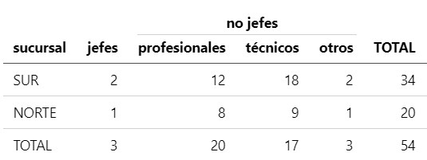
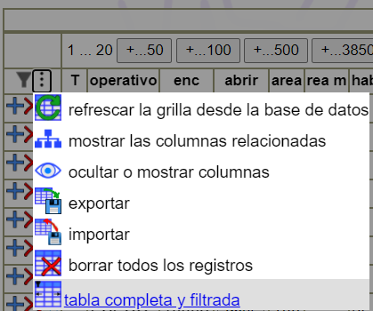

# Reportes que cuentan cosas

## objetivo

Que los reportes, informes o tablas resumen tengan una forma automática 
que le permita al usuario ver los elementos contados en cada categoría. 

Por ejemplo si el reporte es un reporte de empleados por sucursal:

sucursal   | jefes | profesionales | técnicos | otros | TOTAL 
-----------|------:|--------------:|---------:|------:|------:
SUR        |     2 |            12 |       18 |     2 |    34
NORTE      |     1 |             8 |        9 |     1 |    20
TOTAL      |     3 |            20 |       17 |     3 |    54

debería haber una manera para ver la lista de empleados que están en una categoría
(profesionales de la sucursal SUR). 

## antecedentes

Tenemos antecedentes de nuestra forma de caracterizar antes de contar

   1. Desarrollamos [tabulator](https://www.npmjs.com/package/tabulator) en el 2015 con este objetivo,
      la tabla que se genera es un objeto que puede pasarse a HTML, 
      pero no está integrado con las grillas de backend-plus. 
   2. Para las grillas backend-plus tenemos como costumbre definir la tabla poniendo en 
      `sql.from` una subconsulta que caracterice en un campo nuevo los renglones a contar 
      y luego basar la cuenta en ese campo. Eso garantiza que ningún registro se va a contar 2 veces.

No tenemos una forma unificada de revisar. 

## caracterizar antes de contar

Caracterizar antes de contar es un método que asegura que no exista duplicación
involuntaria (por la forma en que se escribieron las expresiones que caracterizan los casos)
ni existan registros que no se contaron. 
Así puede haber una columna de total que seguro es la cantidad de registros revisados. 

Cosas riesgosas pueden ser escribir cosas como:
```sql
select sucursal,
       count(case when es_jefe then 1 else null end) as jefes,
       count(case when categoria='profesional' then 1 else null end) as profesionales,
       count(case when categoria='tecnico' then 1 else null end) as tecnicos,
       count(*) as TOTAL1,
       jefes+profesionales+tecnicos as TOTAL2
    from empleados
    group by sucursal;
```

Ahí TOTAL1 es la cantidad de empleados, TOTAL2 es la suma de las columnas,
un empleado puede estar contado dos veces, como profesional y como técnico. 

Cierto es que podría ocurrir que alguien pidiera un listado donde un registro se cuente dos veces,
es probable que no haya una columna TOTAL para ello. 
De todos modos es buena práctica que eso quede bien claro,
supongamos entonces que está claro que profesionales y técnicos los queremos solo distinguir en los no jefes,
el diseño debería ser algo así:



Queda claro entonces que profesional y técnico se refieren a "no jefes" profesionales y técnicos. 

## programar para el futuro

Pero ¿qué pasa con los que no son jefes ni profesionales ni técnicos?
El usuario nos puede decir solo hay profesionales y técnicos
¿Por qué entonces no usamos un booleano? `es_profesional`. 
¿Será porque es poco descriptivo? ¿será porque algún día podría haber una tercera categoría?.

La pregunta es: ¿es absolutamente inconcebible que exista una categoría más?
Si la respuesta es no, es correcto usar un campo de texto (o quizás uno numérico).
Pero ¿cuál es la programación correcta del SQL que genera el listado?.
¿Hay que prever que puede haber más? Una manera sería agregar el campo "otros".
¿Pero si el usuario nos dice que no quiere esa columna porque no hay "otros"?

> **_Ok, si no hay otros no hay otros_**

Esa frase no dice nada de qué pasa cuando sí hay, la solución es entonces
que haya otros cuando hay. 

O sea se podría contar los otros siempre y controlar si alguno de los registros
tiene un valor distinto de cero y, en el caso de que que haya, mostrar la columna. 

Repitamos entonces el SQL dentro de una subconsulta que caracterice los registros:

```sql
select sucursal,
       count(case when caracterirzacion='jefe' then 1 else null end) as jefes,
       count(case when caracterirzacion='profesional' then 1 else null end) as profesionales,
       count(case when caracterirzacion='tecnico' then 1 else null end) as tecnicos,
       count(case when caracterirzacion='otros' then 1 else null end) as otros,
       count(*) as TOTAL1
    from (
        select sucursal,
               case when es_jefe then 1 else 'jefe'
                    when categoria in ('profesional','tecnico') then categoria
                    else 'otros' 
                end as caracterizacion
            from empleados
    ) as empleados_caracterizados
    group by sucursal;
```

Habiendo quedado claro que la caracterización por jefe era excluyente 
y satisfaciendo al usuario en no mostrar la columna otros mientras no haya otros,
tenemos una formulación con las siguientes ventajas:
   * el total es la suma aunque aparezcan "otros"
   * no hay duplicación

Pero todavía quedan algunos problemas a resolver:
   * no hay interface de usuario para hacer el "master/detail"
   * entre la subconsulta y la consulta de arriba hay código duplicado y baja cohesión;
     si se modifica lo de abajo (agregando alguna categoría y uno se olvida de agregarlo
     arriba va a haber una incoherencia)

## solución rápida para backend-plus

Vamos a diseñar una solución que resuelva el problema del la baja cohesión entre partes.

Se podría crear un nuevo tipo de definición de tablas donde el SQL se arme automáticamente
basado en:
   1. Una definición de grilla típica de backend-plus a nivel de la tabla origen de la cuenta 
   2. Un agregado en la definición que indique cómo es la caracterización. 
   
Algo así como

```ts
function cuenta_empleados(context:TableContext){
    return {
        table:'cuenta_empleados',
        fields:[
            {name:'sucursal', typeName:'text'},
        ],
        classifier:{
            source:'empleados',
            criteria:[
                {name:'jefe', when:'es_jefe'},
                {name:'no jefe', when:`categoria in ('profesional','tecnico')`, then:'categoria'},
                {else:'otros'},
                {name:'total', title:'TOTAL', special:'sum_all'}
            ]
        }
    }
}
```

Ahí vemos casi todos los elementos separados para poder armar el SQL, 
falta saber cuántas columnas habrá en categorías. 
Quitemos entonces el atributo `then`. 

```ts
function cuenta_empleados(context:TableContext){
    return {
        table:'cuenta_empleados',
        fields:[
            {name:'sucursal', typeName:'text'},
        ],
        classifier:{
            source:'empleados',
            criteria:[
                {name:'jefe', when:'es_jefe'},
                {name:`no_jefe_profesional`, when:`categoria = 'profesional'`, title:'profesional'},
                {name:`no_jefe_tecnico`, when:`categoria = 'tecnico'`, title:'técnico'},
                {else:'otros'},
                {name:'total', title:'TOTAL', special:'sum_all'}
            ]
        }
    }
}
```

Si se quisiera que basarse en una lista (que puede ser fija o dependiente del contenido 
de una tabla) se pueden agregar dinámicamente elementos a `criteria`. 

```ts
    ...(['profesional', 'tecnico'].map(cat=>
        {name:`no_jefe_${cat}`, when:`categoria = ${quote_literal(cat)}`, title:cat}
    ),
```

Sigue todavía el problema de cómo visualizar el detalle. Si bien se conoce `classifier.source`
la conexión no se puede hacer directamente porque en el source no existe el clasificador. 

# La solución final

Es claro que es conveniente poder indicar dentro mismo de la tabla empleados que 
hay una clasificación de empleados que se puede usar para contar. 

```ts
function empleados(context:TableContext){
    return {
        table:'empleados',
        fields:[
            {name:'id_empleado', typeName:'text'   },
            {name:'apellido'   , typeName:'text'   , isName:true},
            {name:'nombre'     , typeName:'text'   , isName:true},
            {name:'sucursal'   , typeName:'text'   },
            {name:'turno'      , typeName:'text'   },
            {name:'es_jefe'    , typeName:'boolean'},
            {name:'categoria'  , typeName:'text'   },
        ],
        classifiers:[
            {
                classifier:'jefe_categoria',
                groupers:[
                    ['sucursal'],
                    ['turno'],
                    ['sucursal','turno'],
                ]
                criteria:[
                    {name:'jefe', when:'es_jefe'},
                    {name:`no_jefe_profesional`, when:`categoria = 'profesional'`, title:'profesional'},
                    {name:`no_jefe_tecnico`, when:`categoria = 'tecnico'`, title:'técnico'},
                    {else:'otros'},
                    {name:'total', title:'TOTAL', special:'sum_all'}
                ]
            }
        ]
    }
}
```

¿Qué tenemos con esta definición?. ¿Qué va a hacer tableDefAdapt?
   1. Agregar a fields un campo oculto por cada clasificador ("jefe_categoría" en este caso).
   2. Marcar con `grouper:true` todas las FK que no digan explícitamente `grouper:false`
   3. Agregar en las definiciones de tablas una tabla por cada clasificador/agrupador
      en este caso son 3 tablas nuevas: `empleados__jefe_categoria__sucursal`, `empleados__jefe_categoria__turno`, `empleados__jefe_categoria__sucursal__turno`. 

Luego es solo cuestión de agregarlo esas tablas generadas en el menú. 

Quizás también se pueda poner en el menú contextual de la tabla 
una opción para elegir alguno de las tablas clasificadoras.

